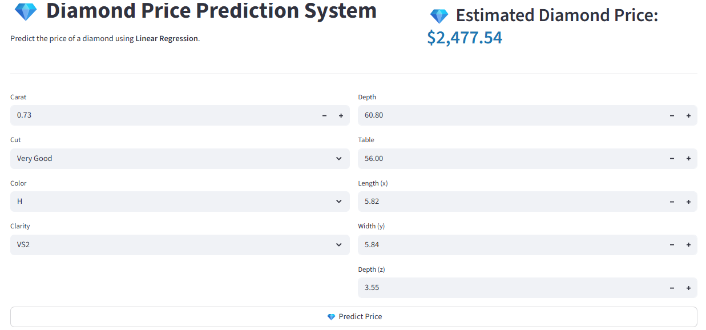

# 💎 Diamond Price Prediction System

A machine learning web application that predicts the price of a diamond based on its physical characteristics using **Linear Regression**. The project includes data cleaning, preprocessing, model training, evaluation, visualization, and an interactive Streamlit web interface.

---

## 📷 Application Preview

<p align="center">
    
</p>

---

## 🚀 Live Demo

**Deployment Link**

https://diamond-pricing-app.streamlit.app/

---

## ✨ Features

- 💎 Predicts diamond prices instantly
- 📊 Interactive Streamlit web interface
- 🧹 Automatic data cleaning
- 📈 Linear Regression model
- 📉 Model evaluation metrics
- 📊 Scatter plot visualization
- 📉 Residual plot analysis
- 📋 Custom diamond price prediction
- 💾 Processed dataset generation
- 🎨 Clean and responsive UI

---

# 🛠️ Technologies Used

| Technology | Purpose |
|------------|---------|
| Python | Programming Language |
| Pandas | Data Manipulation |
| NumPy | Numerical Computing |
| Scikit-learn | Machine Learning |
| Streamlit | Web Application |
| Matplotlib | Data Visualization |
| Joblib | Saving and Loading Model |

---

# 📦 Python Libraries

```
streamlit
pandas
numpy
matplotlib
scikit-learn
joblib
```

Install all dependencies

```bash
pip install -r requirements.txt
```

---

# 📂 Project Structure

```
DiamondPrice_Predictor
│
├── assets
│   ├── interface
│   │   └── app_preview.png
│   │
│   └── visualization
│       ├── correlation_matrix.png
│       ├── prediction_scatter_plot.png
│       ├── price_distribution.png
│       └── residual_scatter_plot.png
│
├── data
│   ├── raw
│   │   └── diamonds.csv
│   │
│   └── processed
│       └── processed_diamonds.csv
│
├── model
│   └── linear_regress_diamond.pkl
│
├── notebooks
│   └── diamond_exploration.ipynb
│
├── src
│   ├── data_cleaning.py
│   ├── data_preprocessing.py
│   ├── data_training.py
│   ├── data_visualization.py
│   ├── model_evaluation.py
│   ├── prediction.py
│   └── main.py
│
├── app.py
├── requirements.txt
└── README.md
```

---

# ⚙️ Installation

Clone the repository

```bash
git clone https://github.com/yourusername/DiamondPrice_Predictor.git
```

Go to the project

```bash
cd DiamondPrice_Predictor
```

Install dependencies

```bash
pip install -r requirements.txt
```

Run the Streamlit application

```bash
streamlit run app.py
```

---

# 📊 Machine Learning Workflow

```
Raw Dataset
      │
      ▼
Data Cleaning
      │
      ▼
Data Preprocessing
      │
      ▼
Train-Test Split
      │
      ▼
Linear Regression Model
      │
      ▼
Model Evaluation
      │
      ▼
Save Trained Model
      │
      ▼
Streamlit Web Application
```

---

# 📈 Model Evaluation

The model is evaluated using:

- Mean Absolute Error (MAE)
- Mean Squared Error (MSE)
- Root Mean Squared Error (RMSE)
- R² Score

Additional visualizations include:

- Actual vs Predicted Scatter Plot
- Residual Plot
- Price Distribution
- Correlation Matrix

---

# 🎯 Input Features

| Feature | Description |
|----------|-------------|
| Carat | Diamond weight |
| Cut | Diamond cut quality |
| Color | Diamond color grade |
| Clarity | Diamond clarity grade |
| Depth | Total depth percentage |
| Table | Table width percentage |
| x | Length |
| y | Width |
| z | Depth |

---

# 📤 Prediction Output

The application predicts the estimated market price of a diamond based on the user-provided characteristics.

Example:

```
Estimated Diamond Price

$4,865.37
```

---

# 👨‍💻 Author

**Christian Devera**

Bachelor of Science in Computer Science

GitHub: https://github.com/yourusername

---

# 📄 License

This project is created for educational and academic purposes.

---

# 🌐 Deployment

**Streamlit**

https://diamond-pricing-app.streamlit.app/